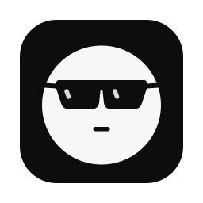
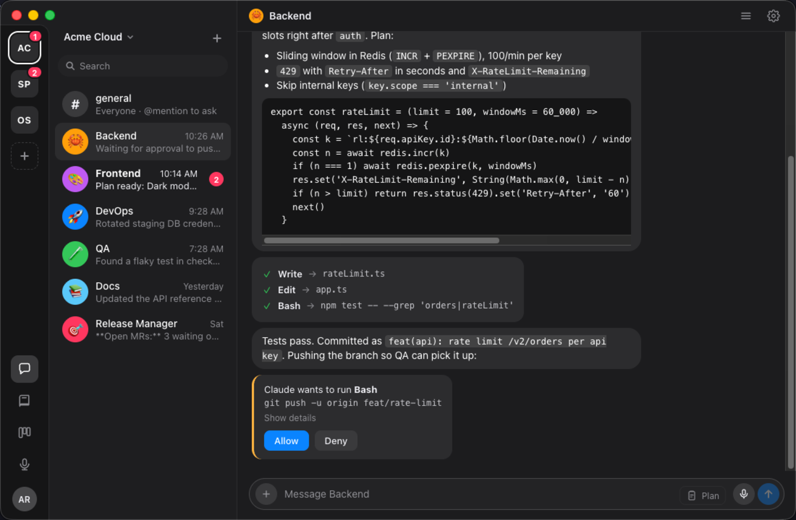
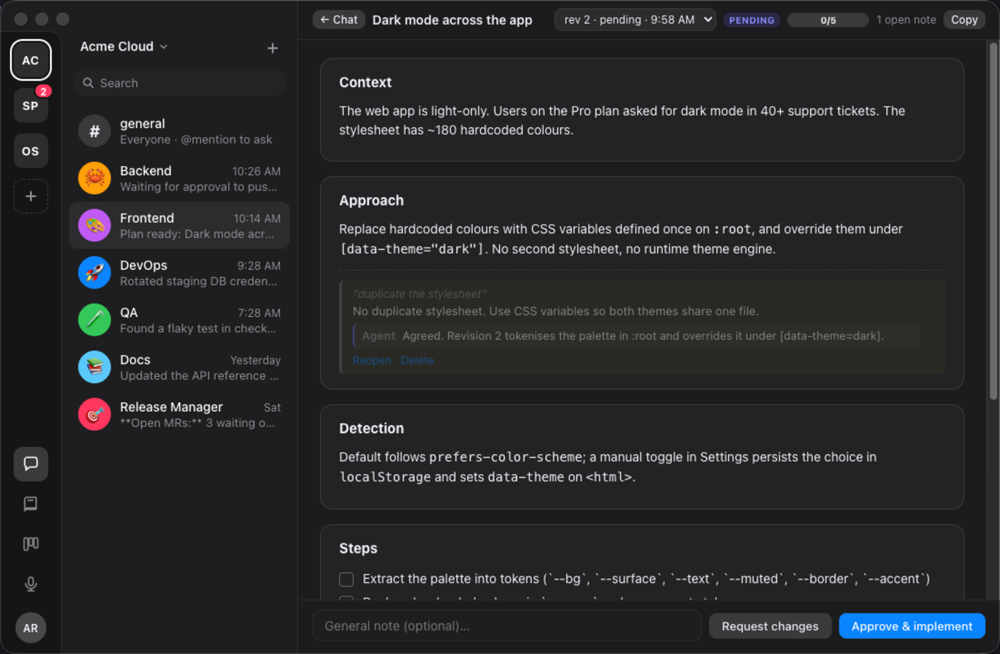
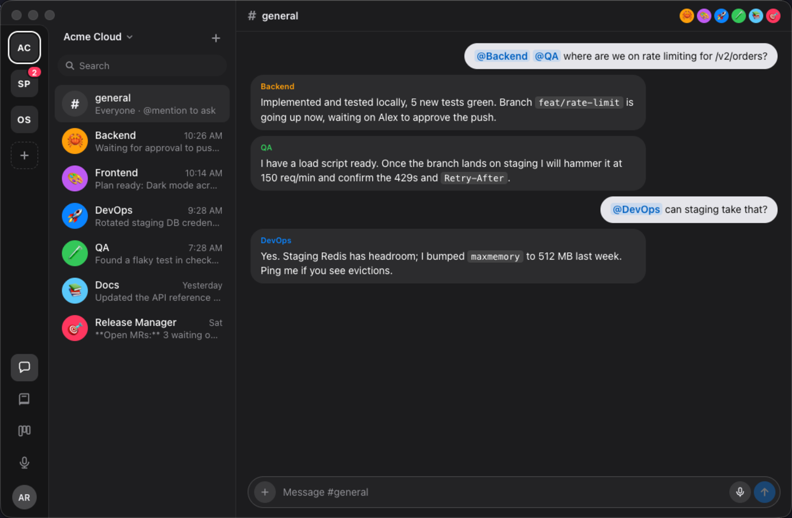
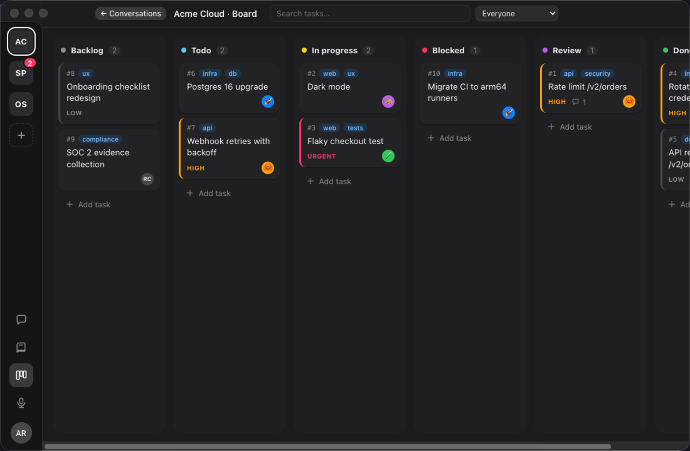
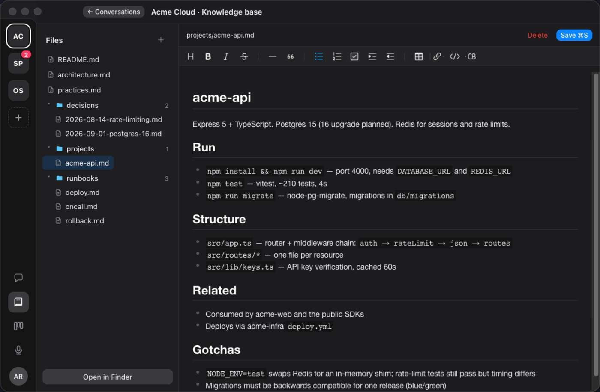
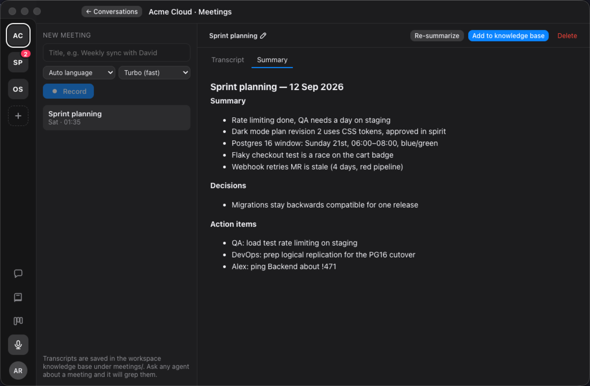
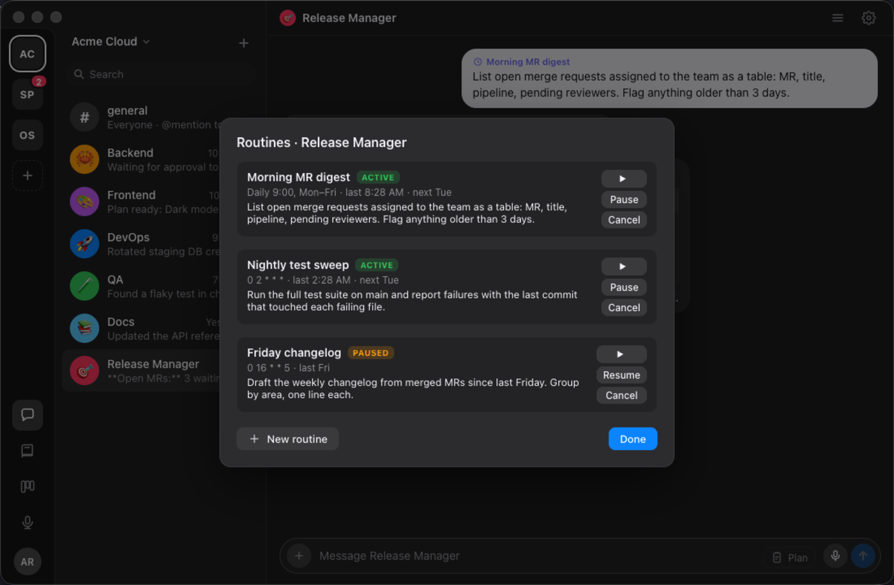
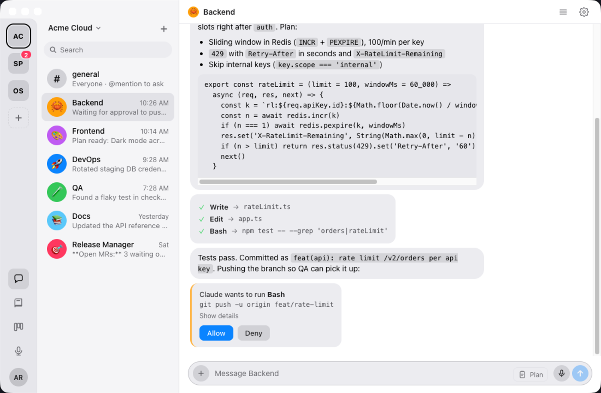

<p align="center">
  
</p>

<h1 align="center">Agent Squad</h1>

<p align="center">
  A macOS desktop for running a whole team of coding agents.<br>
  Each chat is a real <a href="https://docs.anthropic.com/en/docs/claude-code">Claude Code</a> session on your machine.
</p>

<p align="center">
  <a href="LICENSE"></a>
  <a href="https://github.com/rcosta02/agent-squad/releases/latest"></a>
</p>

<p align="center">
  <a href="https://github.com/rcosta02/agent-squad/releases/latest">Download for Mac</a> ·
  <a href="#quick-start">Quick start</a> ·
  <a href="#features">Features</a> ·
  <a href="#development">Development</a> ·
  <a href="#license">License</a>
</p>

---

Agent Squad looks like a messaging app. Behind every conversation is a local Claude Code process with its own folder, model, system prompt and permissions. Agents share a knowledge base, talk to each other in a group chat, pick up tasks from a board, and run on a schedule. Nothing leaves your Mac except what Claude Code already sends.

<p align="center">
  
</p>

## Features

**Agents, in a chat.** Every conversation is a Claude Code session with its own folder, model, system prompt and autonomy level. Tool calls show up as cards, permission requests wait for your Allow. Sessions resume where they left off.

**Plan mode with review.** Ask for a plan, read it as a document, leave inline notes on any line, then approve or request changes. Every revision is kept.

<p align="center"></p>

**Group chat.** `@mention` agents to make them talk to each other. A hop limit keeps them from looping forever.

<p align="center"></p>

**Board.** Kanban with priorities, labels, comments. Assign a task to an agent and it gets to work.

<p align="center"></p>

**Knowledge base.** A git-tracked markdown folder per workspace, exposed to every agent as a skill. Agents read it before answering and write durable facts back. Edit it in place with a WYSIWYG editor.

<p align="center"></p>

**Meetings.** Record mic and system audio, transcribe locally with whisper, summarise with Claude, file the notes into the knowledge base. Nothing leaves your Mac.

<p align="center"></p>

**Routines.** Cron-scheduled prompts per agent: morning MR digests, nightly test sweeps, Friday changelogs.

<p align="center"></p>

**And the rest.** Dictation from the composer. MCP server management with OAuth logins. Markdown with tables, code copy, mermaid diagrams and images. Light and dark themes, adjustable zoom. Silent auto-updates from GitHub Releases.

<p align="center"></p>

## Quick start

1. Install [Claude Code](https://docs.anthropic.com/en/docs/claude-code) and log in: `claude login`.
2. Download the latest `.dmg` from [Releases](https://github.com/rcosta02/agent-squad/releases/latest) and drag it to Applications.
3. Open Agent Squad, enter your name, create a workspace, add an agent pointed at a repo.

That's it. Speech-to-text ships inside the app (whisper.cpp) and the model downloads itself on first launch into `~/.agent-squad/models/`.

## How it works

- Agents run through the [Claude Agent SDK](https://github.com/anthropics/claude-agent-sdk-typescript) against your installed `claude` binary, so your Claude Code settings, skills, hooks and MCP servers apply as-is.
- Everything is stored as JSON and markdown under `~/.agent-squad/`. No database, no cloud.
- The knowledge base is a plain git repo. Open it in Finder from the app, or edit it in place.

## Development

```sh
npm install
npm run native   # build the audio helper (Swift) and bundle whisper-cli from Homebrew (`brew install whisper-cpp`)
npm run dev      # hot reload
npm start        # build + run the built app
npm run dist     # package a signed .app, .dmg and .zip into dist/
```

Requires Node 20+, Xcode command line tools and a `claude` binary on your PATH.

### Environment overrides

| Variable | Purpose |
|---|---|
| `AGENT_SQUAD_HOME` | Data directory (default `~/.agent-squad`) |
| `AGENT_SQUAD_CLI` | Path to the `claude` binary |
| `AGENT_SQUAD_WHISPER` | Path to `whisper-cli` (default: bundled) |
| `AGENT_SQUAD_WHISPER_MODEL` | Path to a whisper model file |
| `AGENT_SQUAD_AUDIOTAP` | Path to the audio helper binary |

## Contributing

Issues and PRs welcome. Keep changes small, boring and tested in the real app.

## License

Agent Squad is free software, licensed under the **GNU General Public License v3.0 or later** (GPL-3.0-or-later).
Copyright © 2026 Rafael Costa.

Full text in [LICENSE](LICENSE) and at [gnu.org/licenses/gpl-3.0](https://www.gnu.org/licenses/gpl-3.0.html). Notice for source headers in [COPYRIGHT](COPYRIGHT).
